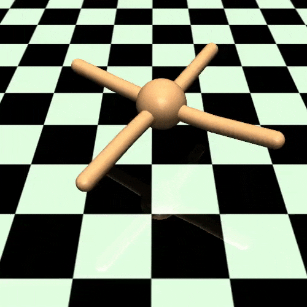
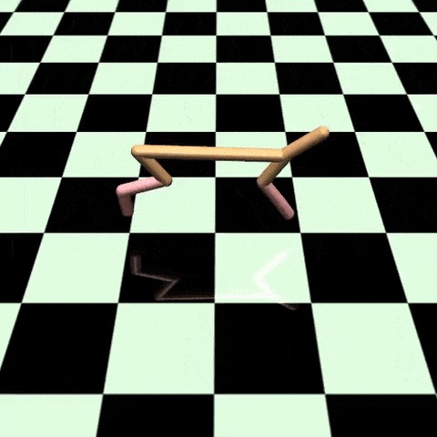
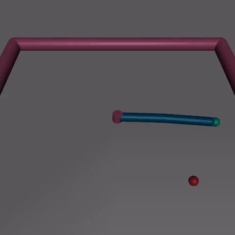
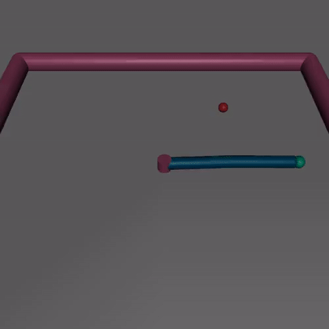
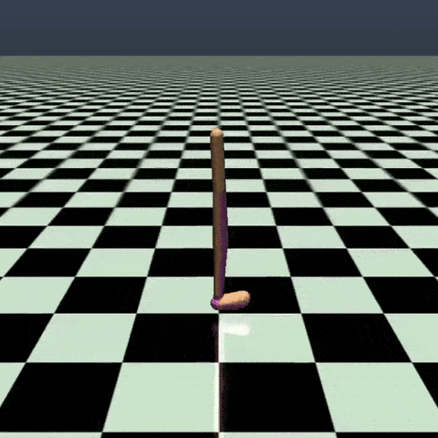

**Homework 1**

The goal of this project was to implement behavioral cloning and DAgger 
(Dataset Aggregation) policies.

[Task statement](txt/statement.pdf)

[Solution - official format](txt/solution.md)

### Environments

We will play with MuJoCo

