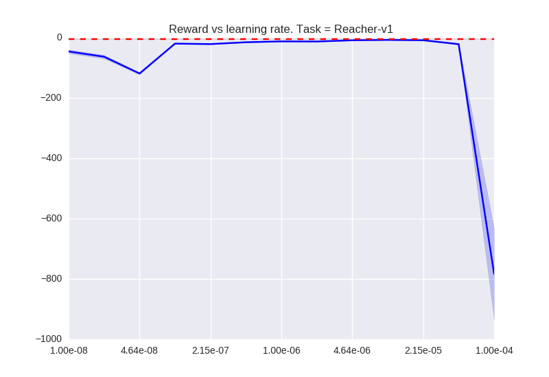
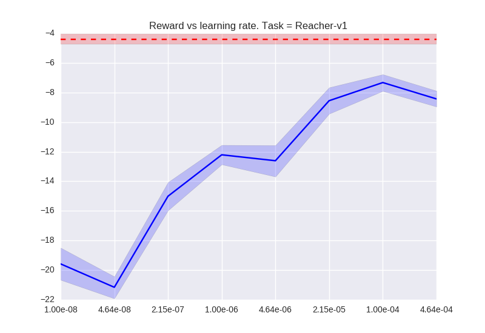
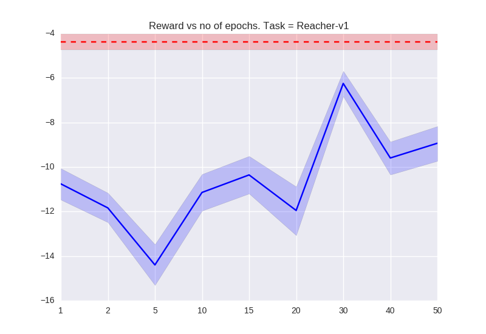
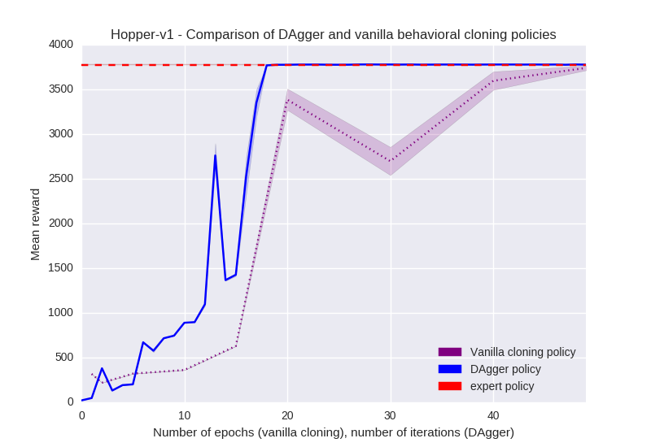

# Solution HW no 1

TODOs:
*  make docstrings for functions!!
* make a more interesting writeups here...

The goal of this task was to implement behavioral cloning and DAgger policies and compare
how well they perform compared to the provided expert policy.

### Question 2.2 - vanilla behavioral cloning

Architecture used:
* Normalization of inputs (mean, std)
* 2 Dense layers of 64 neurons, TanH activations
* Dense output layer
* ADAM optimizer, constant learning rate of 0.001, batch size of 256,
  30 epochs (each over full training data)
* 30 rollouts of the expert used, 10 % of data used for validation,
  each rollout rolled out until open-ai-gym defined `env.spec.timestep_limit`

###### Succesful example
On task Ant-v1, the behavioral

  Ant-v1         |      expert |   imitation
-----------------|-------------|------------                 
mean reward      |        4823 | 4776
std reward       |       87    | 92
pct full rollout |   100%      |  100%

###### Example where expert is better

  Reacher-v1         |      expert |   imitation
-----------------|-------------|------------                 
mean reward      |  -4.39  | -10.06
std reward       |   2.00     | 4.62
pct full rollout |   100%      |  100%

### Question 2.3 - Sensitivity of behavioral cloning to hyperparameters

Learning rate is training metaparameter that is always interesting to check.
Here it looks as if there is pretty good stable region for the hard task.

Zoom into the most interesting region.

What about the number of training epochs? This give us indication about 
how much data we need to train the cloning policy.

### Question 3 - DAgger

Get data for this task by running `run_dagger.py`. Above tasks need to be run first.

Result, presented for task `Hopper-v1` for which the DAgger policy outperforms vanilla.

