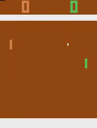

# Homework 3 - Deep Q Learning

The goal of this task is to implement the true classic - Deep Q Learning
algorithm for Atari game.

The learning environment is supplied by the popular

See http://rll.berkeley.edu/deeprlcourse/docs/hw3.pdf for the task 
instructions.

Note from instructors was:

> The starter code was based on an implementation of Q-learning for Atari
> generously provided by Szymon Sidor from OpenAI.

# Result
It works! See the below footage of the algorithm _destroying_ the default 
game AI.

# Possible TODOs
- Make nice training graphs (perhaps showing the testing / training error
  variance in different runs?).
- Add some flow to this writeup

